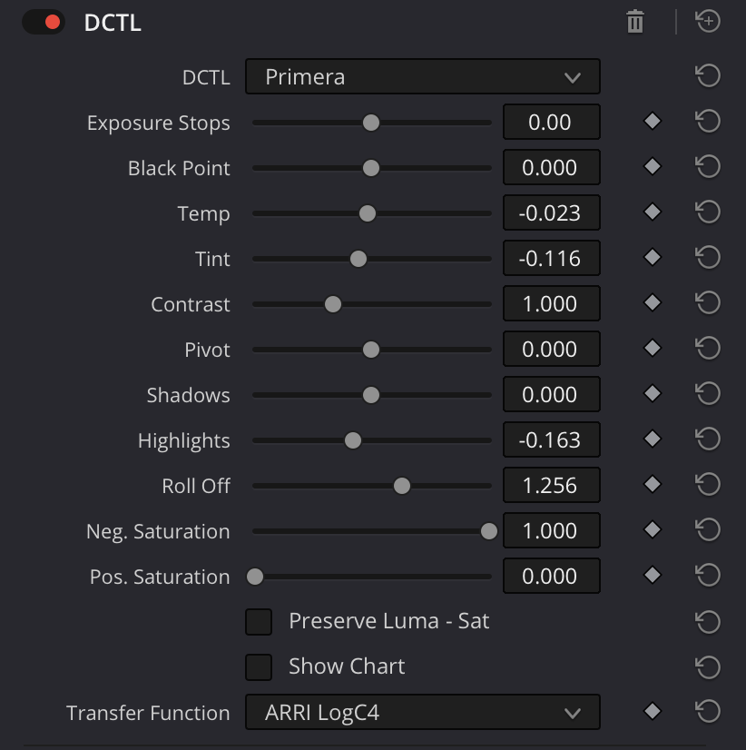
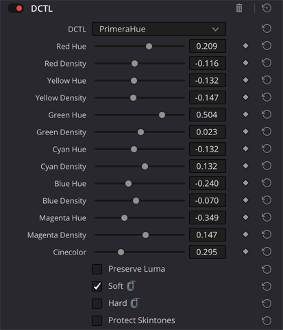
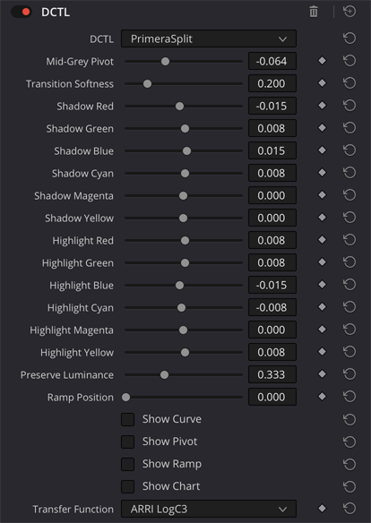
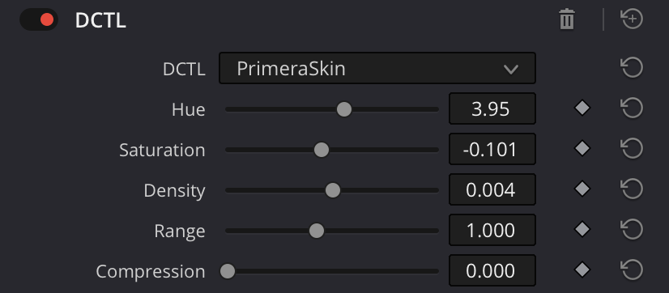

## Primera Suite

Primera is my personal suite of DaVinci Resolve Studio color grading DCTLs for clip-level grading and look development. Built from shared code fragments via `make`. The latest release of the ‘built’ DCTLs is always available in the sidebar at right.

Most of the underlying math comes from tried-and-tested open-source DCTLs by generous members of the “color-concerned community" (see at bottom). Primera consolidates the approaches I reach for most often into one place, under one name, and with only the controls I actually use.

The aesthetic lodestar is a "film look" in the broad sense, but rather than emulating any specific stock or process, I’m more chasing my personal "sense memories" of projected film. Hopefully however, these tools are flexible enough to achieve any number of looks/styles.

### Primera

  

`Primera.dctl` is the foundational tool, providing primary grading controls for shot-to-shot balancing:

- **Exposure** — Linear gain in photographic stops (`2^n`) applied before the selected transfer function
- **Black Point** — Smooth compression of the darkest tones approaching black (sometimes called "flare," e.g. in Baselight)
- **Temp / Tint** — self-explanatory ("white balance"); operates in linear space
- **Contrast** — a typical Log-space stretch/squash of the tonal range around a variable **Pivot** which defaults to the transfer function's mid-grey point
- **Shadows / Highlights** — Linear gain constrained below/above mid-grey; no spatial operations so can be encoded in a 3D LUT
- **Roll Off** — `tanh` highlight compression controlling where the brightest values top out; works with Highlights to shape/compress the shoulder
- **Neg. Saturation** — Multiplicative negative RGB gain on chroma (only darkens)
- **Pos. Saturation** — HSV-based saturation boost (the 'S' "channel"), positive only; adds "density"
- **Preserve Luma** — weighted offset of the darkening effect from both saturation controls
- **Show Chart** — draws a per-transfer-function step chart graduated in stops a là [Walter Volpatto's example](https://youtu.be/ymr4wyo7GcA?t=3665)
- **Transfer Function** — for now, only the ones I encounter most in my day-to-day: LogC3, LogC4, REDLog3G10, S-Log3, ACEScct, DaVinci Intermediate, and Kodak Cineon

### Primera Hue

  

`PrimeraHue.dctl` performs per-channel hue and density control via tetrahedral interpolation, based on [hotgluebanjo](https://github.com/hotgluebanjo/TetraInterp-DCTL)’s DCTL implementation of the approach described by Steve Yedlin ASC in his [DisplayPrep](https://www.yedlin.net/DisplayPrepDemo/index.html) demo (2018)

- **6 Hue sliders** (R/Y/G/C/B/M) — Each pushes a color toward/away from its neighbors via Rodrigues rotation around each corner's achromatic axis. +/-60° per channel covers the full 360°
- **6 Density sliders** — Makes the shifted color subjectively more "colorful" without adding energy
- **Preserve Luma** — Scales output to a nominal level before density adjustment. Runs before Cinecolor (see below)
- **Hard Clamp** — Clips to [0,1] before interpolation
- **Soft Clamp** — `tanh` in the shoulder + exponential compression in the toe after interpolation to softly limit range excursion
- **Cinecolor** — emulates a [budget color process](https://www.youtube.com/watch?v=dnNeKxt0urk) (~late '30s-early '50s), similar to Technicolor Process 2, that used bipacked (contact exposure) ortho negatives and duplitized print stock (emulsion on both sides of the base); here for you now in the 2020s without the registration nightmares
- **Protect Skintones** — Applies only to Cinecolor. Creates a holdout matte centered on the skintone indicator (~28° on an HSV disc) with smooth falloff

### Primera Split

  

`PrimeraSplit.dctl` provides subtractive color split-toning for imbuing shadows and highlights with (typically) contrasting color casts. Lately conceptualized less as an ‘effect' and more a fundamental look development tool, defining the chroma dimensions of the characteristic curve.

- **Mid-Grey Pivot** — Defaults to the selected transfer function's mid-grey (but should be set purely by eye)
- **Transition Softness** — self-explanatory
- **Preserve Luminance** — as in Primera and PrimeraHue
- **Ramp Position** — positions the greyscale ramp vertically (such as for desqueezed anamorphic shots)
- **Show Curve** — shows an RGB representation of the the current slider states
- **Show Pivot** — visualizes the position of the pivot point and transition softness
- **Show Chart** — draws a per-transfer-function step chart graduated in stops a là [Walter Volpatto's example](https://youtu.be/ymr4wyo7GcA?t=3665) and prints the curve name and 18% grey value over a rectangle of the value
- **Transfer Function** — Aligns **Pivot** to the appropriate mid-grey point

### Primera Skin

  

`PrimeraSkin.dctl` is a dedicated skintone 'sculpting' tool operating in the OKLCH color model. Targets a soft region of the HSV disc centered on the nominal skin tone hue (~28° counter-clockwise) and applies perceptually uniform adjustments within that region. Everything outside the mask passes through untouched.

- **Hue** — Rotates skin hue in OKLCH (+/-30°)
- **Saturation** — Scales chroma symmetrically; both positive and negative directions stay in OKLCH for consistent behavior with no hue shift
- **Density** — Adjusts lightness (positive = darker)
- **Range** — Widens or narrows the skin mask (0.25 = tight +/-7°, 1.0 = default +/-28°, 2.0 = broad +/-56°)
- **Compression** — pulls adjacent hues near the boundaries of the skintone indicator towards the median; meant to emulate HMU evening-out talent skintones on set during shooting
- **Show Mask** — shows a monochrome overlay of the affected area

Gamut containment is done via the same "soft squeeze" described above (`tanh` in the shoulder/exponential compression in the toe).

### Notes

- Maybe/hopefully it goes without saying, at this point, but the Primera tools are meant to be used in the context of a fully color-managed workflow. See [here](https://www.youtube.com/watch?v=JpRuQQ__-YA) for a good primer.
- The Primera tools should play nicely with most DRTs (DRT = Display Rendering Transform, the final image formulation stage prior to outputting a deliverable) but has been used/tested most with my preferred DRT, [Jed Smith](https://github.com/jedypod)'s [OpenDRT](https://github.com/jedypod/open-display-transform)
- I also regularly use/test the tools with Resolve's CST, [Juan-Pablo Zambrano](https://github.com/JuanPabloZambrano)'s excellent [2499 DRT](https://github.com/JuanPabloZambrano/DCTL/tree/main/2499_DRT), the [ACES 2.0](https://acescentral.com) [transforms](https://github.com/aces-aswf/aces-core), and occasionally a favorite LUT
- Note that it is possible to produce negative or otherwise out-of-range values with these tools, despite the guardrails in place. When this happens, I reach for gamut compression first to help contain things over and above the containment described above/throughout
- Kaur Hendriksen made a great, [free standalone DCTL](https://store.kaurh.com) that implements the ACES 2.0 gamut compression coefficients which I can whole-heartedly recommend

### Inspiration 

There's not much particularly original in the Primera tools, as I said they're more of a curated/opinionated collection of my favorite approaches to primary grading and some aspects of look development. In no particular order, Primera owes 90%+ of its existence to the work of the following individuals:

- [Jed Smith](https://github.com/jedypod)
- [Juan Pablo Zambrano](https://github.com/JuanPabloZambrano)
- [Moaz Elgabry](https://github.com/MoazElgabry)
- [Thatcher Freeman](https://github.com/thatcherfreeman)
- [Paul Dore](https://github.com/baldavenger)
- [Kaur Hendrikson](https://kaurh.com)
- [Calvin Silly](https://github.com/calvinsilly) / [hotgluebanjo](https://github.com/hotgluebanjo)
