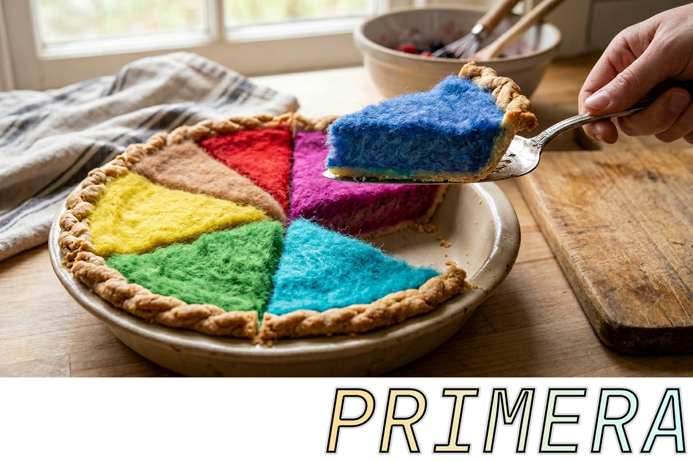
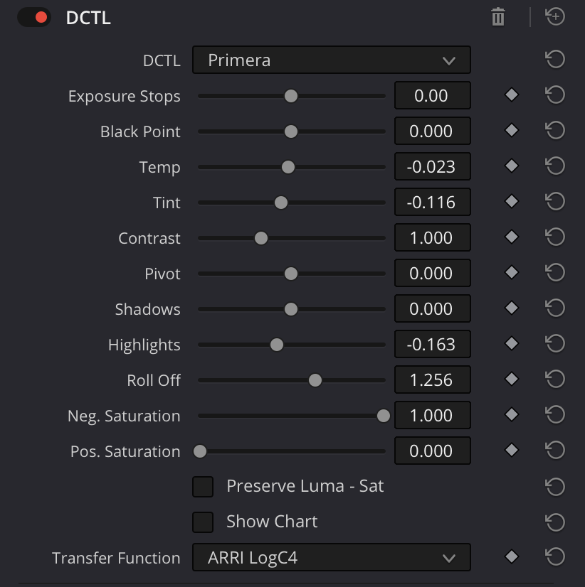
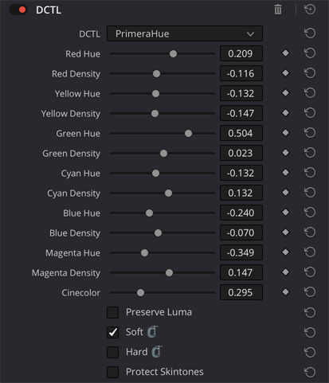
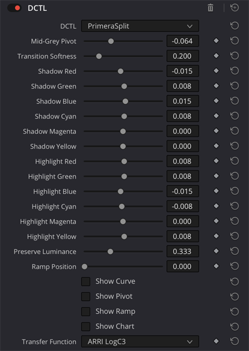
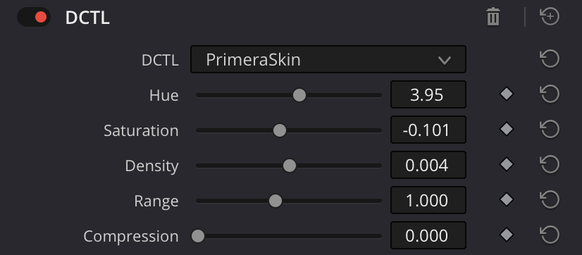

  

## Primera Suite

Primera is [my](https://www.linkedin.com/in/geoffsm) personal suite of [DaVinci Resolve Studio](https://www.blackmagicdesign.com/products/davinciresolve) color grading DCTLs for both clip-level grading and some aspects of look development. The DCTLs are built via reusable code fragments via `make` (+ plenty of help from Claude). The latest release of the built DCTLs is always available to download (above on the web and in the sidebar to the right as a .zip file under Releases on GitHub).

Most of the underlying math comes from tried-and-tested publicly-available imaging science approaches and from my own extensive use of open-source DCTLs by many generous members of the “color-concerned community" (see at bottom). Primera consolidates the approaches I reach for most often into one place, under one name, and with only the controls I actually use.

My personal aesthetic lodestar remains a "film-like look," in the broad sense, but rather than emulating any specific stock or process (with one exception), I’m more chasing my personal past and on-going "sense memories" of seeing and working with film. Hopefully the tools are flexible enough to achieve most any look/style.

### Primera

  

`Primera.dctl` is the foundation and provides primary grading controls for shot-to-shot balancing:

- **Exposure** — Linear gain in photographic stops (`2^n`) applied before the selected transfer function
- **Black Point** — Smooth compression of the darkest tones approaching black (sometimes called "flare," e.g. in Baselight)
- **Temp / Tint** — self-explanatory ("white balance"); operates in linear space
- **Contrast** — a typical Log-space stretch/squash of the tonal range around a variable **Pivot** which defaults to the transfer function's mid-grey point
- **Shadows / Highlights** — Linear gain constrained below/above mid-grey; no spatial operations so can be encoded in a 3D LUT
- **Roll Off** — `tanh` highlight compression controlling where the brightest values top out; works with Highlights to shape/compress the shoulder
- **Neg. Saturation** — Multiplicative negative RGB gain on chroma (only darkens)
- **Pos. Saturation** — HSV-based saturation boost (gain on the 'S' "channel"), positive only; adds "density"
- **Preserve Luma** — weighted offset of the darkening effect from both saturation controls
- **Show Chart** — draws a per-transfer-function step chart graduated in stops a la [Walter Volpatto's example](https://youtu.be/ymr4wyo7GcA?t=3665)
- **Transfer Function** — for now, only the ones I encounter most in my day-to-day: LogC3, LogC4, REDLog3G10, S-Log3, ACEScct, DaVinci Intermediate, Kodak Cineon, Fuji F-Log2, and Panasonic V-Log

### Primera Hue

  

`PrimeraHue.dctl` performs per-channel hue and density control via tetrahedral interpolation, based on [hotgluebanjo](https://github.com/hotgluebanjo/TetraInterp-DCTL)’s DCTL implementation of the approach described by Steve Yedlin ASC in his [DisplayPrep](https://www.yedlin.net/DisplayPrepDemo/index.html) demo (2018)

- **6 Hue sliders** (R/Y/G/C/B/M) — Each pushes a color toward/away from its neighbors via Rodrigues rotation around each corner's achromatic axis. +/-60° per channel covers the full 360°
- **6 Density sliders** — Makes the shifted color subjectively more "colorful" without adding energy
- **Preserve Luma** — Restores pre-adjustment Rec. 709 luminance by uniform gain. Runs *after* the hue/density interpolation and *before* Cinecolor (see below)
- **Soft 🗜️** (soft squeeze, on by default) — `tanh` in the shoulder + exponential compression in the toe, applied last, to softly limit range excursion
- **Hard 🗜️** (hard squeeze) — Clips the *rotated corner values* to [0,1] before interpolation, not the pixel itself; both squeeze schemes can be applied at the same time ("all the clamps")

Note that PrimeraHue passes any pixel with a channel outside [0,1] straight through untouched — tetrahedral interpolation is only defined on the unit cube. Feed it a log signal, not scene-linear.
- **Cinecolor** — emulates a [budget color process](https://www.youtube.com/watch?v=dnNeKxt0urk) (~late '30s-early '50s), similar to Technicolor Process 2, that used bipacked (contact exposure) ortho negatives and duplitized print stock (emulsion on both sides of the base); here for you now in the 2020s without the registration nightmares
- **Protect Skintones** — Applies only to Cinecolor. Creates a holdout matte centered on the skintone indicator (~28° on an HSV disc) with smooth falloff

### Primera Split

  

`PrimeraSplit.dctl` provides subtractive color split-toning for imbuing shadows and highlights with (usually) contrasting color casts. Lately conceptualized less as an ‘effect' and more a fundamental look development tool, defining the chroma dimensions of the characteristic curve.

- **Mid-Grey Pivot** — Defaults to the selected transfer function's mid-grey (but should be set purely by eye)
- **Transition Softness** — self-explanatory
- **Preserve Luminance** — as in Primera and PrimeraHue
- **Show Ramp** — overlays a greyscale ramp put through the identical toning pipeline, so you can read the tint applied at every tonal position
- **Ramp Position** — positions the greyscale ramp vertically (useful when blanking has been applied)
- **Show Curve** — shows an RGB curves representation of the the current slider states
- **Show Pivot** — visualizes the position of the pivot point and transition softness
- **Show Chart** — draws a per-transfer-function step chart graduated in stops a la [Walter Volpatto's example](https://youtu.be/ymr4wyo7GcA?t=3665); prints the curve name and 18% grey value over a rectangle of the same value
- **Transfer Function** — Aligns **Pivot** to the appropriate mid-grey point

### Primera Skin

  

`PrimeraSkin.dctl` is a dedicated skintone sculpting tool operating in HSV. Meant for log-based timelines (any camera's log or log/log-like working spaces like DaVinci Wide Gamut/Intermediate or ACEScct). Everything outside the mask passes through untouched. I don't use this on every shot but it can be handy for "surgical" chroma operations targeting skintones. It mostly does what you might want but is still an on-going work-in-progress. One slider (Soften) performs a spatial operation so the node this tool is on should be bypassed when creating a 3D LUT.

Detection is **rg-chromaticity**-based rather than a plain hue/saturation slice: the pixel is normalized by `r+g+b`, which makes the ratios invariant to overall brightness, so the mask should catch fair and dark skin equally well. Log-space skin clusters tightly around `g/(r+g+b) ≈ 0.33` with red leading blue. A hue gate centered on the nominal skin angle (~28°) attempts to keep **Range** meaningful as a user control. In other words, it creates a "fuzzy pie slice," centered on the skintone line with a chromaticity gate in front of it.

- **Hue** — Rotates skin hue (+/-20°)
- **Saturation** — Scales HSV saturation within the mask (gain on the 'S' "channel")
- **Density** — Adjusts value/brightness (positive = darker)
- **Range** — Widens or narrows the skin mask (0.25 = tight, 2.0 = broad)
- **Soften** — Spatial pooling of the mask. Soften pools the mask over a sparse 37-tap neighborhood (weighted by distance and chroma similarity) and soft-*unions* the result with the pixel's own mask, so it can only fill holes, never erode a confident edge. Radius is resolution-independent (~15px at UHD at full strength). At 0 no taps are made at all. Note that spatial operations cannot be represented in a 3D LUT.
- **Evenness** — Compresses hues toward the skin center; meant to emulate HMU evening-out talent skintones on set during shooting
- **Separation** — This control Inverts the (pooled) skin mask, acting on everything that* isn't *skin.*  The inverted mask gates a gentle hue migration toward the band opposite the skin vector — skin sits at 28°, its complement at ~208°, the cyan/teal band. This is the mechanism underlying, conceptually, the teal-and-orange look: complementary opposition between a warm subject and a comparatively cool field. This control attempts to keep neutrals, well, neutral and is capped at ~30% migration (27° max). Pay special attention to reds however, crimson drifts toward magenta well before the slider runs out of travel.
- **Low Gate / High Gate** — Value-based gates that exclude dark or bright pixels from the mask (useful for protecting shadows and specular highlights)
- **Show Mask** — False-color overlay of mask qualification. Gold = in the skin zone; green/cyan = hue sits counter-clockwise of skin center; magenta = hue sits clockwise of it. Tint intensity tracks mask strength. Zone classification uses the *original* hue, and so tries to stay stable as the Hue slider is moved
- **Legend** — A continuous gradient strip across the bottom 7.5% of frame, labeled GREEN / SKIN / MAG. left to right, matching both the Show Mask colors and the Hue slider's direction (left = green, right = magenta).

Gamut containment is done via the same "soft squeeze" described above (`tanh` in the shoulder and exponential compression in the toe), but here it is scaled by the mask. Pixels that are only faintly pooled into the mask get proportionally less clamping squeeze to avoid the (spatial) Soften control introducing banding around faces against bright or dark backgrounds. 

### Notes

- For the curious, the math used in the Primera tools is available in both [`typst`](./doc/primera-math.typ) and [PDF](./doc/primera-math.pdf) (feedback welcome)
- Maybe/hopefully it goes without saying at this point but the Primera tools are meant to be used in the context of a fully color-managed workflow. See [here](https://www.youtube.com/watch?v=JpRuQQ__-YA) for a decent primer.
- The Primera tools should play nicely with most any DRT (DRT = Display Rendering Transform, the final image formulation stage prior to outputting a deliverable) but has been used/tested most with my preferred DRT, [Jed Smith's](https://github.com/jedypod) [OpenDRT](https://github.com/jedypod/open-display-transform)
- I also regularly use/test the tools with Resolve's CST, [Juan-Pablo Zambrano's](https://github.com/JuanPabloZambrano) excellent [2499 DRT](https://github.com/JuanPabloZambrano/DCTL/tree/main/2499_DRT), the [ACES 2.0](https://acescentral.com) [transforms](https://github.com/aces-aswf/aces-core), and occasionally a favorite LUT
- Note that it is possible to produce negative or otherwise out-of-range values with these tools, despite the guardrails in place. If this happens, I'd reach for gamut compression first to wrangle things back into range (if something’s obviously broken, please file an issue).
- Kaur Hendriksen made a great, [free standalone DCTL](https://store.kaurh.com) that implements the ACES 2.0 gamut compression coefficients which I can whole-heartedly recommend (Resolve's ACES Transform gamut compression or Color Space Transform's Saturation Compression could also be used)

### Inspiration 

There's not much particularly original in the Primera tools, like I said they're more of a curated/opinionated collection of my favorite approaches to primary grading and some aspects of look development. In no particular order, Primera owes 90%+ of its existence to the work of the following individuals:

- [Jed Smith](https://github.com/jedypod)
- [Juan Pablo Zambrano](https://github.com/JuanPabloZambrano)
- [Moaz Elgabry](https://github.com/MoazElgabry)
- [Thatcher Freeman](https://github.com/thatcherfreeman)
- [Paul Dore](https://github.com/baldavenger)
- [Kaur Hendrikson](https://kaurh.com)
- [Calvin Silly](https://github.com/calvinsilly) / [hotgluebanjo](https://github.com/hotgluebanjo)
